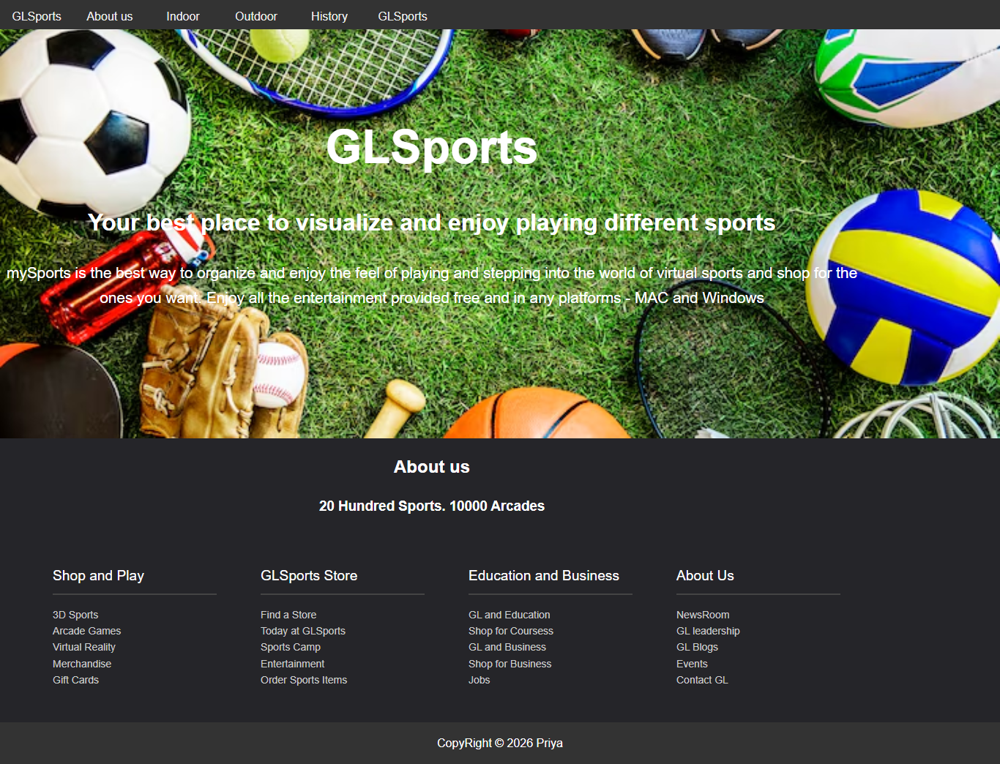

# ⚽ GLSports Shop Page

"Your best place to visualize and enjoy playing different sports."

A clean, modern sports retail and information landing page. This project focuses on structuring complex grid-like components, handling transparent overlays, and building organized multi-column navigation footers.

## 🚀 Live Demo
[👉 Click here to check out the store layout live!](https://priya-bhagat01.github.io/my_sports_project/)

## 📸 Full Preview

## 🛠️ Key Layout Features
- **Hero Image Integration:** Positioned high-impact sports graphics as a backdrop with crisp typography overlays.
- **Multi-Column Footer:** Engineered an extensive site navigation footer divided perfectly into distinct categories (Shop and Play, GLSports Store, Education and Business).
- **Navigation Bar Structure:** Implemented a full-width header block highlighting dynamic categorization like Indoor, Outdoor, and History segments.

## 🧰 Tech Stack
- HTML5
- CSS3
